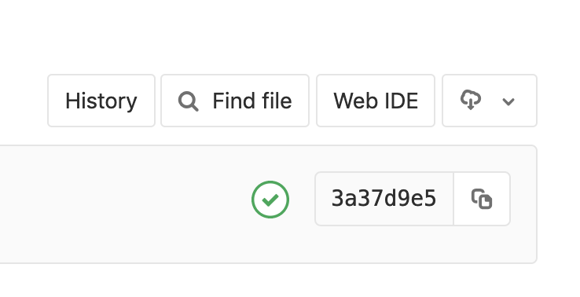

# Les prérequis

* Créer un nouveau projet
* Associer un shared runner au projet
* Le plus facile est de directement travaller avec `Web IDE` integré à GitLab

 

[< Previous](../README.md) | [Home](../README.md) | [Next >](../exercice_1/README.md)