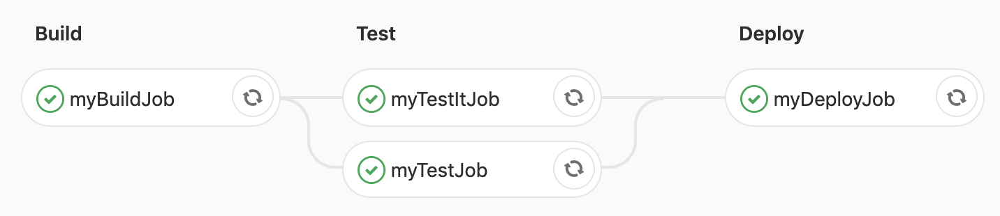

# Les basiques

Dans cet exercice nous allons utiliser la syntaxe basique du fichier `.gitlab-ci.yml`.
Nous utiliserons les notions de script, de job et de stage afin de construire un premier pipeline.

> L'interface web de GitLab CI dispose d'un linter permettant de valider la syntaxe du fichier de configuration. 
> Le linter est disponible sous `<your_project_namespace>/-/ci/lint`
 
## 1. Utiliser les jobs et les stages
    
* Créer un pipeline contenant un unique job affichant "Hello World".
<details><summary>Solution</summary>
<p>

```yaml
myJob:
  script:
    - echo "Hello World"
```

</p>
</details>
 
* A quel stage votre job a-t'il été rattaché lors de son exécution ?

<details><summary>Solution</summary>
<p>

> Le stage par defaut est `test`

</p>
</details>
 
* Ajouter 3 stages à votre configuration (`build`, `test`, `deploy`)

<details><summary>Solution</summary>
<p>

```yaml
stages:
  - build
  - test
  - deploy
```

</p>
</details>

* Rattacher à chaque stage un job affichant le nom de job.

<details><summary>Solution</summary>
<p>

```yaml
stages:
  - build
  - test
  - deploy

myBuildJob:
  stage: build
  script:
    - echo "Running the build script"

myTestJob:
  stage: test
  script:
    - echo "Running the test script"

myDeployJob:
  stage: deploy
  script:
    - echo "Running the deploy script"
```

</p>
</details>

* Ajouter un job supplémentaire (lancement des tests IT par exemple) qui tournera parallèlement au premier job de test.

<details><summary>Solution</summary>
<p>

```yaml
stages:
  - build
  - test
  - deploy

myBuildJob:
  stage: build
  script:
    - echo "Running the build script"

myTestJob:
  stage: test
  script:
    - echo "Running the test script"

myTestItJob:
  stage: test
  script:
    - echo "Running the integration test script"

myDeployJob:
  stage: deploy
  script:
    - echo "Running the deploy script"
```

<p>

</p> 


</p>
</details>

## 2. Les commandes avant et après un job

A l'entrée ou à la sortie d'un job il est possible de réaliser des opérations supplémentaires selon les besoins.
Ces opérations peuvent être **globales** ou **spécifiques au job**.

* Ajouter un `before_script` global dans la configuration. Un simple `echo "Running the default before script"` suffira. 
* Ajouter un `before_script` spécifique au job rattaché au stage `test`.
* Vérifiez pour chaque job quel `before_script` a été finalement lancé.
* Que peut-on en déduire de la priorité entre un `before_script` global et un `before_script` à l'intérieur d'un job ?

<details>
<summary>Solution</summary>
<p>

```yaml
stages:
  - build
  - test
  - deploy

before_script:
  - echo "Running the default before script"

myBuildJob:
  stage: build
  script:
    - echo "Running the build script"

myTestJob:
  stage: test
  before_script:
    - echo "Running the before script for myTestJob" 
  script:
    - echo "Running the first test script"
    
myDeployJob:
  stage: deploy
  script:
    - echo "Running the deploy script"
```

</p>
</details>

## 3. Un exemple plus concret

Dans les faits un `before_script` est surtout utile pour vérifier les pré-requis d'un job et le faire échouer si besoin.
Essayons de mettre cela en pratique via un simple `apt-get`.

* Réinitialiser le fichier de pipeline.
* Créer nouveau un job. Vous pouvez omettre de définir les `stages`.
* Exécuter la commande `tree`. Ne pas oublier de d'installer le paquet lors du `before_script`.

<details><summary>Solution</summary>
<p>

```yaml
build:
    before_script:
        - apt-get update
        - apt-get install tree
    script:
        - tree
```

</p>
</details>


[< Previous](../exercice_0) | [Home](..) | [Next >](../exercice_2)