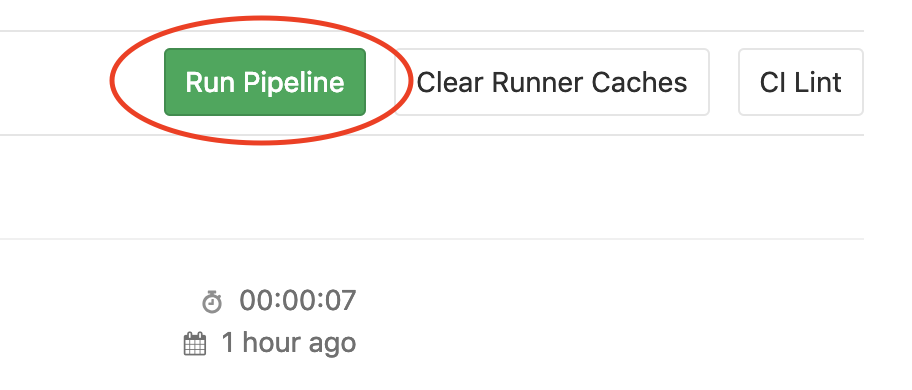
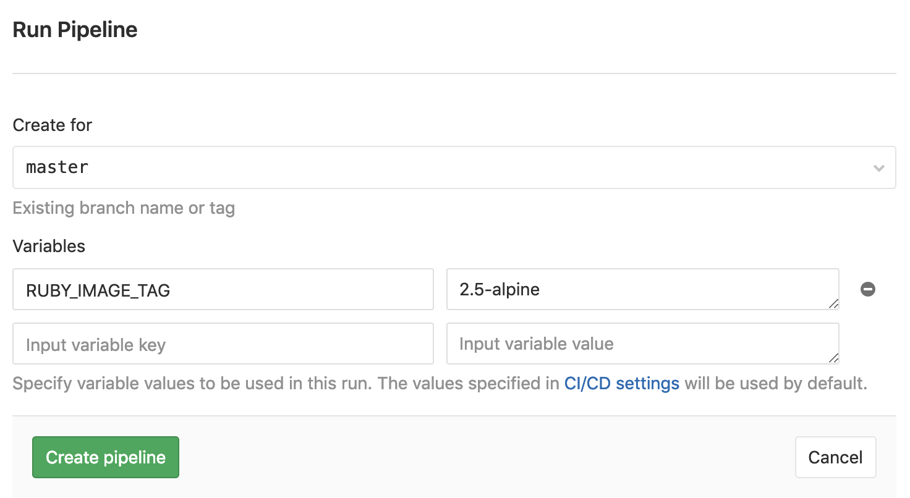

# Utilisation de Docker

Dans cet exercice nous allons voir comment un job peut être exécuté au sein d'une image Docker. 
Nous en profiterons pour rajouter des variables dans la configuration du pipeline. 
Puis nous les utiliserons directement dans le container.

* [Documentation](https://docs.gitlab.com/ce/ci/docker/README.html)

## 1. Définir une image Docker globale
    
* Définir une image **globale** reposant sur l'image Docker `ruby:alpine`.  
* Créer un job affichant la version de Ruby.

<details>
<summary>Solution</summary>
<p>

```yaml
image: ruby:alpine
    
myRubyTest:
  stage: test
  script:
    - ruby -v
```

</p>
</details>

## 2. Jobs identiques, images différentes 

Il est possible de faire cohabiter plusieurs versions d'une même image dans un pipeline.
Il devient ainsi possible de lancer des jobs identiques mais exécutés dans des configurations différentes. 
Ceci peut s'avérer utile si votre application doit supporter plusieurs versions. 
On pense ici à `python`, `java` ou encore `node` pour ne pas les citer.

Pour illuster cet exercice nous utiliserons l'image Docker de [Ruby](https://hub.docker.com/_/ruby) `ruby:<version>-alpine`
 
* Créer un pipeline composé de deux jobs.
* Utiliser une image différente pour chacun des jobs.
* Les jobs devront afficher la version courante de Ruby.

<details>
<summary>Solution</summary>
<p>

```yaml
myRubyTest:2.6:
  stage: test
  image: ruby:2.6-alpine
  script:
    - ruby -v

myRubyTest:2.5:
  stage: test
  image: ruby:2.5-alpine
  script:
    - ruby -v
```

</p>
</details>

## 3. Variables de pipeline

Vous l'aurez remarqué, la précédente configuration oblige de créer un nouveau job pour chaque version de Ruby.
Nous allons essayer de faire un peu mieux en utilisant une variable de pipeline.

* Ajouter la variable globale `RUBY_IMAGE_TAG`, valeur par défaut `alpine` : `RUBY_IMAGE_TAG: alpine`. 
* Dans le job :
    * Utiliser `RUBY_IMAGE_TAG` pour construire la variable `RUBY_IMAGE`
    * Utiliser `RUBY_IMAGE` pour la définition de l'image.
    * Afficher le résultat de la commande `ruby -v`

<details>
<summary>Solution</summary>
<p>

```yaml
variables:
  RUBY_IMAGE_TAG: alpine

myRubyTest:
  stage: test
  variables:
    RUBY_IMAGE: ruby:${RUBY_IMAGE_TAG}
  image: $RUBY_IMAGE
  script:
    - ruby -v
```

</p>
</details>

* Utiliser le lanceur de pipeline manuel en surchargeant la variable `RUBY_IMAGE_TAG` avec la valeur `2.5-alpine`.

<details>
<summary>Solution</summary>
<p>

<p>

</p> 

... puis ...

<p>

</p> 

</p>
</details>

[< Previous](../exercice_1) | [Home](..) | [Next >](../exercice_3)