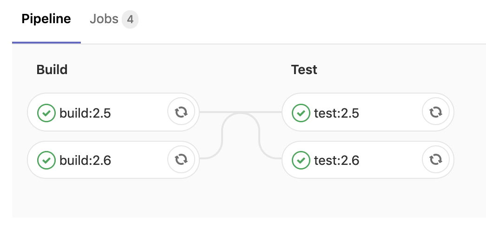

# Utilisation du cache et des artefacts

Dans cet exercice nous allons partager certains éléments entre les jobs à l'aide des notions de cache et d'artefacts. 

## 1. Le cache

`cache` est utilisé pour spécifier une liste de fichiers et de répertoires à mettre en cache entre les `jobs`. 
Vous ne pouvez utiliser que les chemins situés dans l'espace de travail du projet.

Si le `cache` est défini en dehors des `jobs`, cela signifie qu'il est défini globalement et que tous les `jobs` utiliseront cette définition.

* Créer un pipeline constitué de deux jobs :
    * Sans définir le cache pour le moment
    * Définir un job `build` - y scripter la création d'un fichier `build-info.txt` dans un répertoire `build`
    * Définir un job `test` - y verifier l'existence de ce fichier (`if [ ! -f build/build-info.txt ]; then exit 1; fi`)
* Le fichier produit par le job `build` est-il disponible dans le job `test` ?
* Déclarer un cache :
    * Path `./build/`
    * Optional : utiliser un `key` de cache pour l'isoler entre les pipelines
* Vérifier que le pipeline passe "au vert"

<details>
<summary>Solution</summary>
<p>

```yaml
cache:
  key: "$CI_COMMIT_REF_SLUG"
  paths:
    - ./build/

build:
  stage: build
  before_script:
    - rm -rf ./build
    - mkdir ./build
  script:
    - echo "test" > build/build-info.txt

test:
  stage: test
  script:
    - if [ ! -f build/build-info.txt ]; then exit 1; fi
```

</p>
</details>

## 2. Les artefacts

`artefacts` est utilisé pour spécifier une liste de fichiers et de répertoires qui doivent être attachés au `job` après succès.
Une fois le `job` terminé, les `artefacts` seront envoyés à GitLab et pourront être téléchargés dans l'interface utilisateur de GitLab.

* Ajouter un job `dist` (stage `deploy`) construisant un `tar.gz` à partir du contenu de repertoire `build` (`tar zcvf dist/artifact.tar.gz build/`)
* Déclarer le `tar.gz` comme artefact du build. Cet artefact doit :
    * Etre disponible dans le répertoire `dist`
    * Avoir une durée de vie à `5 minutes`
    * Etre téléchargable dans un zip nommé `<projet>-<branche>-<sha1 du commit>` (cf. les variables d'environement d'un pipeline)

<details>
<summary>Solution</summary>
<p>

```yaml
cache:
  key: "$CI_COMMIT_REF_SLUG"
  paths:
    - ./build

stages:
  - build
  - test
  - deploy

build:
  stage: build
  before_script:
    - rm -rf ./build
    - mkdir ./build
  script:
    - echo "test" > ./build/build-info.txt

test:
  stage: test
  script:
    - if [ ! -f ./build/build-info.txt ]; then exit 1; fi

dist:
  stage: deploy
  before_script:
    - rm -rf ./dist
    - mkdir ./dist
  script:
    - tar zcvf ./dist/artifact.tar.gz ./build 
  artifacts:
    name: "$CI_PROJECT_NAME-$CI_COMMIT_REF_NAME-$CI_COMMIT_SHORT_SHA"
    paths:
      - dist/
    expire_in: 5 mins
```

<p>

</p> 

</p>
</details>

## 3. Lier les jobs

En s'inspirant du pipeline de l'exercice [2.2](../exercice_2) créer un pipeline contenant :
* Deux jobs de build
    * Produisant chacun un fichier texte contenant la sortie de la commande `ruby -v`
    * Exécutés avec deux versions différentes de l'image Ruby 
* Deux jobs de test
    * Affichant le contenu du fichier texte construit pendant le job de build

Au final le graphe de dépendance entre les jobs serait donc le suivant : 

>build:X -> test:X
>
>build:Y -> test:Y

<details>
<summary>Solution</summary>
<p>

```yaml
stages:
  - build
  - test

build:2.6:
  stage: build
  image: ruby:2.6-alpine
  script:
    - ruby -v > build_2.6.txt
  artifacts:
    paths:
      - build_2.6.txt
    expire_in: 1 min

build:2.5:
  stage: build
  image: ruby:2.5-alpine
  script:
    - ruby -v > build_2.5.txt
  artifacts:
      paths:
        - build_2.5.txt
      expire_in: 1 min

test:2.6:
  stage: test
  image: ruby:2.6-alpine
  script:
    - cat build_2.6.txt
  dependencies:
    - build:2.6

test:2.5:
  stage: test
  image: ruby:2.5-alpine
  script:
    - cat build_2.5.txt
  dependencies:
    - build:2.5
```

<p>

</p> 

</p>
</details>

    
[< Previous](../exercice_2) | [Home](../README.md) | [Next >](../exercice_4)