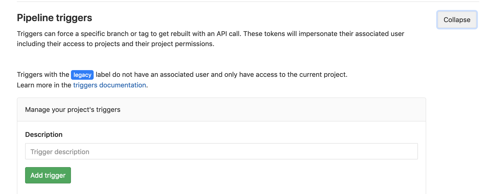

# Lancement d'un pipeline à partir de pipeline

Le but de cet exercise sera de montrer comment déclencher un pipeline à partir d'un autre pipeline.

* Ici, nous lançerons automatiquement le pipeline `deploy` à partir du pipeline `build` afin de simuler un déploiement continu sur l'environnement de *dévelopement* _(Attention : seule la branche master sera concernée)_.  
* Néanmoins, déclencher un déployement continu dans l'environnement de *production* n'est pas forcément voulu et nous souhaiterions donc pouvoir nous arrêter à la fin de la *livraison continue*. 
* Pour ce faire, nous ajouterons la possibilité de lancer *manuellement* le pipeline `deploy` lorsqu' il s'agira de l' environnement de *production* 


## 1. Lancement d'un pipeline `deploy` à partir de pipeline `build`

* Créer deux projets GitLab (nommés `myBuildPipeline` et `myDeployPipeline` par exemple) avec leurs fichiers `.gitlab-ci.yml` respectifs.
* Dans `myBuildPipeline` : 
    * Créer un job `myBuild`, attaché à un stage `build`.
    * Créer un job `myDeployTrigger:dev`, attaché le job au stage `deploy`.
        * Utiliser l'image `byrnedo/alpine-curl` pour disposer de `curl`.
        * Limiter le lancement du job à la branche `master` (utiliser l'instruction `only:`).
* Dans le projet `myDeployPipeline` : 
    * Créer un job `myDeploy:dev`. 
    * Créer un nouveau trigger (see [documentation](https://docs.gitlab.com/ce/ci/triggers/README.html#ci-job-token))
    * Récupérer l'ID du projet. Cet ID sera utilisé plus tard par le trigger.

<p>

</p> 

<p>

</p> 

<p>

</p> 

* Utiliser les instructions pour compléter le job `myDeployTrigger:dev` du projet `myBuildPipeline`


<details>
<summary>Solution</summary>
<p>

```yaml

myBuild:
    stage: build
    script:
        - echo "Build"
    
myDeployTrigger:dev:
    stage: deploy
    image: byrnedo/alpine-curl
    script:   
        - curl --request POST --form "token=$CI_JOB_TOKEN" --form ref=master https://gitlab.com/api/v4/projects/<myDeployPipeline_project_id>/trigger/pipeline
    only:
        - master
```

```yaml

myDeploy:dev:
    stage: deploy
    script:
        - echo "Deploy"
```

</p>
</details>


## 2. Les jobs manuels

* TODO

[< Previous](../exercice_4) | [Home](..) | [Next >](../exercice_6)